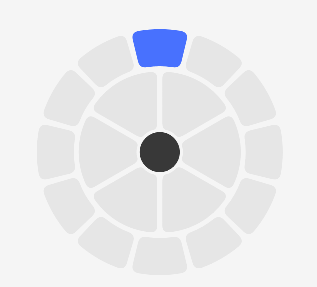
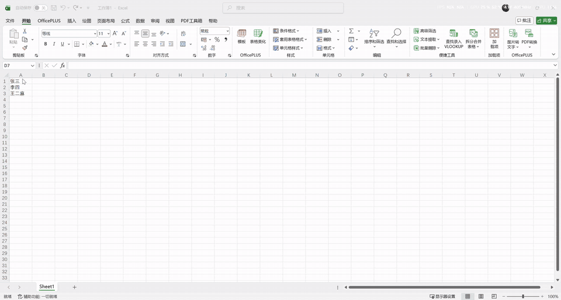
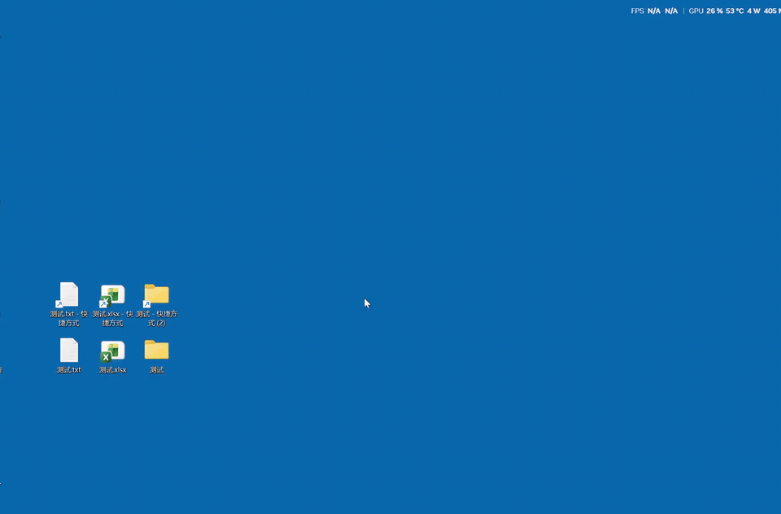

# 超级中键

## Windows 剪贴板轮盘工具



你是否厌倦了在多个窗口之间反复复制、粘贴和寻找历史内容？

超级中键是一款面向 Windows 的剪贴板轮盘工具。按住鼠标中键即可呼出轮盘，从最近复制的内容中快速选择，松开鼠标后直接粘贴到当前窗口。

本项目代码由ai编写，人工校验完成效果。

运行环境：一个坚固标中键（Windows 10/11 64位，无其他依赖）

## 开源许可

主项目采用 [Apache License 2.0](LICENSE)。共享更新组件
`shared/DesktopUpdateKit` 作为 Git submodule 接入并采用 MIT License；完整归属说明见
[NOTICE](NOTICE) 和 [THIRD-PARTY-NOTICES.md](THIRD-PARTY-NOTICES.md)。

## 功能

| 功能 | 说明 |
|------|------|
| 中键轮盘 | 按住中键显示圆形/矩形轮盘，鼠标方向选择，松开粘贴；无历史时也可唤起空轮盘；轮盘激活期间拦截滚轮误触，避免 PPT 等应用翻页 |
| 突破轮盘 | 圆形模式下突破外缘可唤出外圈动作槽，支持快捷键和 `.lnk` 快捷方式；未配置槽位不参与选中并回落到内圈选择 |
| 剪贴板历史 | 启动后台读取 Win+V 历史补底，运行期自己监听并置顶，维护最近 8 条 |
| 多格式 | 文本 / HTML / RTF / CSV / TSV，Excel 表格粘贴保留格式 |
| 图片支持 | 可选捕获剪贴板图片，轮盘使用缩略图预览，粘贴保留原图（设置中开启） |
| Quick Copy | 最后一个扇区固定为 Ctrl+C 复制按钮 |
| 临时锁定 | 轮盘选中历史扇区后右键切换锁定，当前运行期内不被新剪贴板顶走 |
| 托盘 | 左键切换捕获开关，右键菜单（设置/清空/退出），双色图标；设置窗口保持单例 |
| 绿色免装 | 单 exe 运行，设置写入 `%AppData%\超级中键\settings.json` |
| 单实例 | 启动时自动检测并阻止重复运行 |

基础轮盘与突破动作演示：





## 下载

普通用户可从 [GitHub Releases](https://github.com/wet86y/clipboard-wheel/releases/latest)
下载最新稳定版。程序为绿色免安装单 EXE；当前尚未使用 Windows 代码签名证书，请仅从
本仓库 Release 获取，并保留随发布资产提供的许可证与第三方声明。

## 构建

项目只维护 Release 源码路径；调试运行版和打包发布版都从同一套 Release 配置产出。

源码位于 `src\ClipboardWheel`，共享更新组件位于 `shared\DesktopUpdateKit`，脚本位于
`scripts`，构建生成物统一位于 `build`，正式发布包位于 `artifacts`。首次克隆必须初始化
子模块：

```powershell
git clone --recurse-submodules https://github.com/wet86y/clipboard-wheel.git
```

已有工作区可执行 `git submodule update --init --recursive`。项目不依赖固定磁盘路径或
当前工作目录，移动时应保留完整仓库结构。

| 版本 | 命令 | 产物位置 | 用途 |
|------|------|----------|------|
| 调试运行版 | `dotnet build .\src\ClipboardWheel\ClipboardWheel.csproj -c Release /p:PasteTraceNextToExecutable=true` | `build\bin\Release\超级中键.exe` | 本地测试；日志写在程序同级目录 |
| 打包发布版 | `scripts\build-release.ps1` | `artifacts\超级中键-win-x64\超级中键.exe` | 自包含单文件，不写日志，分发用 |

维护时只认定上述两个输出目录：调试运行版的 `build\bin\Release` 与正式包的 `artifacts\超级中键-win-x64`。不得创建或维护 `artifacts\超级中键-debug-win-x64` 等额外调试分发目录，也不得手工修改 `build/` 或 `artifacts/` 内的编译产物。

调试运行版写同级 `paste-trace.log`（粘贴链路毫秒级事件日志）；打包发布版由脚本显式关闭日志，不生成 `paste-trace.log`。

## 项目文档

- `docs/BRANCH_PROJECT.md`：分支项目目标、边界、维护纪律和合入条件。
- `docs/EXTENDED_WHEEL_DESIGN.md`：突破轮盘功能拓展设计草案。
- `docs/RELEASE_CHECKLIST.md`：打包发布前的代码、编译、手测和提交检查清单。
- `docs/BUILD_OUTPUT_CONTRACT.md`：调试运行版与正式打包版的唯一维护路径和产物约束。
- `docs/用户使用说明.md`：给普通使用者阅读的简明说明。
- `docs/ACCEPTANCE_TESTS.md`：完整人工验收清单。
- `docs/DESIGN_NOTES.md`：关键设计决策和历史取舍。
- `docs/IMPLEMENTATION_GUIDE.md`：实现结构和维护入口。
- `docs/SHARED_UPDATE_ARCHITECTURE.md`：本项目如何通过 Git submodule 接入 `DesktopUpdateKit`。

## 托盘操作

- **左键单击**：切换中键捕获 开/关。图标即时变化（蓝色圆 = 开启，灰色圆 = 关闭）
- **右键单击**：弹出菜单（启用/禁用轮盘、设置、清空历史、退出）
- **设置入口**：只通过右键菜单的“设置”打开；重复点击只会激活已有设置窗口，不会创建多个。

## 设置要点

| 设置 | 说明 |
|------|------|
| 快捷复制 | 最后一个扇区固定为复制按钮（深绿色），选中即 Ctrl+C |
| 扇区锁定 | 轮盘打开时选中历史扇区并右键，蓝灰色表示锁定；再次右键解除。Quick Copy 扇区不可锁定；切换形状/扇区数后会按当前可见历史槽位归一化 |
| 图片捕获 | 默认关闭；打开后实时捕获剪贴板图片，轮盘中显示缩略图 |
| 形状/扇区 | 圆形 4/6/8（切换默认 6），矩形 4/8（切换默认 8） |
| 轮盘大小/死区/透明度 | 单页设置窗口直接调整，保存后即时写入 settings.json |

粘贴模式固定为 Smart：单格文本走纯文本，表格 HTML 走格式化；含 `<table>` 的合并单元格自动识别。文本/富文本剪贴板捕获固定为全格式，图片捕获由设置开关单独控制，历史固定 8 条；中键轮盘是否启用由托盘图标/菜单控制。Ctrl/Shift 修饰键不再改变粘贴模式。

## 诊断

调试运行版使用 `dotnet build .\src\ClipboardWheel\ClipboardWheel.csproj -c Release /p:PasteTraceNextToExecutable=true`，每次粘贴会在 `build\bin\Release\paste-trace.log` 写入诊断记录。
打包发布版通过 `scripts/build-release.ps1` 打包。

提交前可运行 `scripts\run-self-check.ps1`，它会构建调试版并检查日志门控和剪贴板监听基础约束。

```bash
# 查看最后 200 条
Get-Content .\build\bin\Release\paste-trace.log -Tail 200
# 只看最后一次 paste
Select-String "PasteAsync_end" .\build\bin\Release\paste-trace.log | Select-Object -Last 1
```
